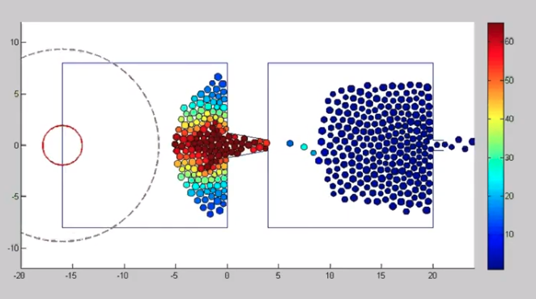

# Term Proposal - Crowd Evacuation Simulation

## Motivation

People often fall into panic when they meet dangers like fire and they will loss ability of thinking over calmly. Hence, they may lose the tiny opportunity of being out of danger. If we can simulate the situation that crowd evacuate from indoor to outdoor when breaking out of fire, then we can schedule the escape route more smoothly to prevent disaster.

## Ideas

 - Randomly generate the escape route.
 - Simulate the flocking behavior of human.
 - Simulate the panic behavior of people when they meet fire.
 - Take human's thought into consideration.
 - Calculate the amount of time that people evacuating from indoor to outdoor.
 - Store the best escape route to help schedule the route.

## Example

Crowd evacuation simulation example. Each dot represents a person. The circle on left side represents a danger. The color on each dot is the panic degree.

 
---

## Reference
 - [Crowd modeling and simulation with contagious panic: Panic evacuation](https://www.youtube.com/watch?v=SCm0mKPdY3M)
 - [Dynamic Interactive Crowd Simulation using Stress Based Behavior](https://users.csc.calpoly.edu/~zwood/teaching/csc572/final17/smseiber/index.html?fbclid=IwAR2Cw7XXhafc5HrfROChYzjc39_VEAKA8xG15sW2Z7h3ppjmdehuKV9K_6I)
 - [Boid](https://en.wikipedia.org/wiki/Boids)
 - [Social Force Model for Pedestrian Dynamics](https://arxiv.org/abs/cond-mat/9805244)